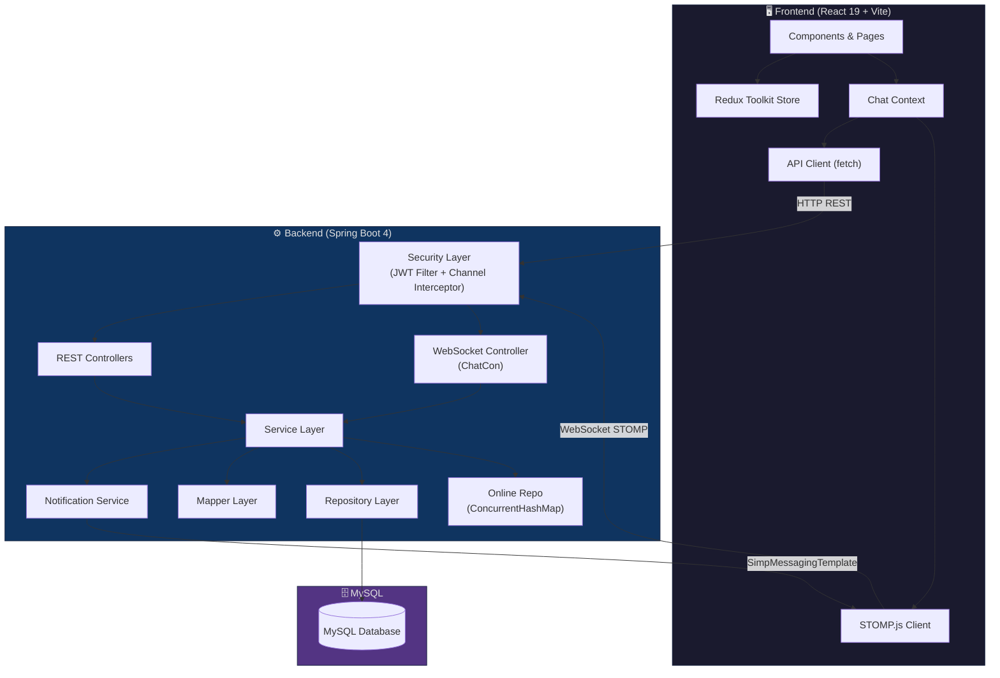
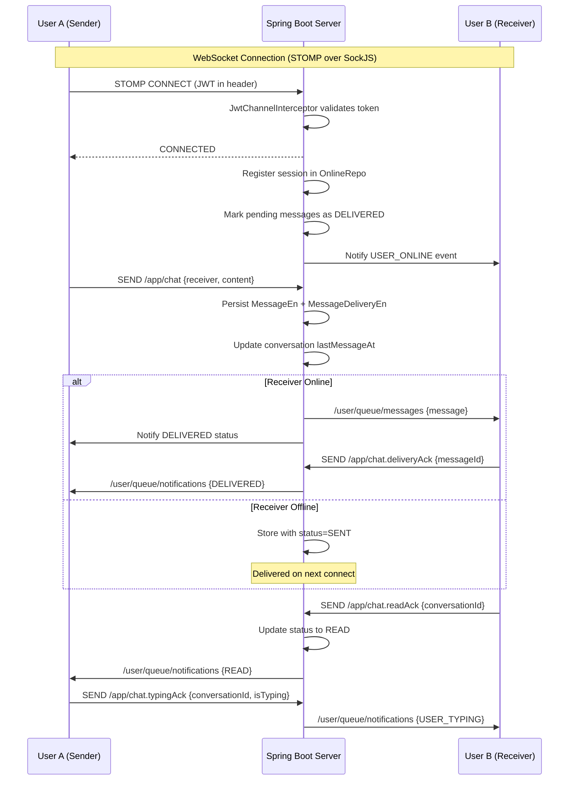
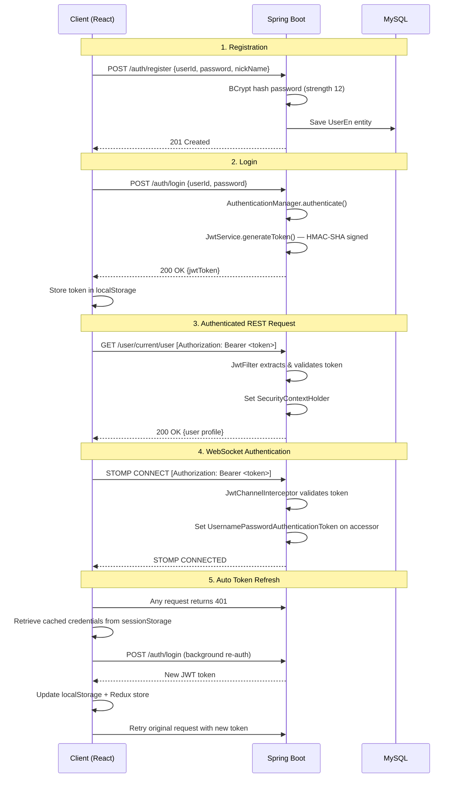
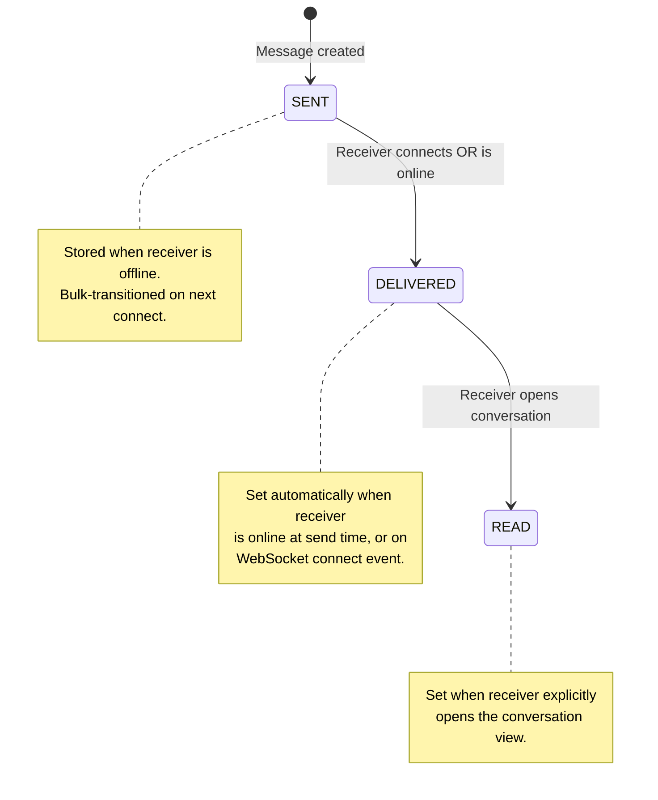

<div align="center">

# 💬 NexusChat

### A Secure, Scalable, Real-Time Messaging Platform

[](https://spring.io/projects/spring-boot)
[](https://react.dev/)
[](https://openjdk.org/)
[](https://www.mysql.com/)
[](https://stomp.github.io/)
[](https://jwt.io/)
[](LICENSE)
[]()

---

**NexusChat** is a production-grade, full-stack real-time messaging platform built with **Spring Boot** and **React**. It delivers instant one-on-one messaging over **WebSockets (STOMP protocol)** with end-to-end **JWT authentication**, **delivery & read receipts**, **typing indicators**, and **online presence tracking** — all backed by a persistent **MySQL** database.

[Features](#-features) · [Architecture](#-architecture) · [Getting Started](#-getting-started) · [API Overview](#-api-overview) · [Roadmap](#-future-roadmap)

</div>

---

## 📋 Project Overview

NexusChat addresses the need for a **secure, low-latency messaging system** that can be self-hosted and extended. Unlike cloud-dependent chat solutions, NexusChat gives developers full control over their messaging infrastructure while maintaining a modern, production-quality user experience.

**Who is it for?**

- **Developers** looking for a reference implementation of real-time WebSocket messaging with Spring Boot and React
- **Teams** needing a self-hosted, privacy-first internal communication tool
- **Students & learners** exploring full-stack architecture patterns — JWT authentication, STOMP protocol, state management, and database design

**What makes it different?**

- 🔐 **Dual-layer JWT authentication** — HTTP REST APIs *and* WebSocket STOMP connections are independently secured
- 📨 **Three-state message tracking** — Every message transitions through `SENT → DELIVERED → READ` with real-time notifications
- 🟢 **Live presence system** — In-memory session tracking with instant online/offline broadcasts to conversation partners
- ⚡ **Optimistic UI updates** — Messages appear instantly in the UI before server confirmation, with automatic delivery acknowledgements

---

## ✨ Features

| Category | Feature | Description |
|:---------|:--------|:------------|
| 🔑 **Authentication** | JWT Authentication | Stateless token-based auth with HMAC-SHA signing and configurable expiration |
| 🔑 **Authentication** | User Registration | Secure account creation with BCrypt password hashing (strength 12) |
| 🔑 **Authentication** | Auto Token Refresh | Transparent background re-authentication on 401 responses using cached credentials |
| 🛡️ **Security** | Spring Security | Full security filter chain with CSRF disabled for REST API compatibility |
| 🛡️ **Security** | WebSocket Auth | JWT-validated STOMP CONNECT interceptor — unauthenticated connections are rejected |
| 🛡️ **Security** | Protected Routes | Frontend route guards redirect unauthenticated users to the landing page |
| 💬 **Messaging** | Real-Time STOMP Messaging | Bidirectional message delivery over SockJS + STOMP with automatic reconnect |
| 💬 **Messaging** | REST Fallback Messaging | HTTP-based message sending when WebSocket is unavailable |
| 💬 **Messaging** | Message Persistence | All messages stored in MySQL with conversation-level indexing |
| 📬 **Receipts** | Delivery Receipts | Automatic `DELIVERED` status when recipient is online; bulk delivery on reconnect |
| 📬 **Receipts** | Read Receipts | Per-conversation `READ` marking with real-time status broadcast to sender |
| ✍️ **Interaction** | Typing Indicators | Real-time typing status broadcast per conversation |
| 🟢 **Presence** | Online / Offline Tracking | In-memory ConcurrentHashMap-based session registry with WebSocket event listeners |
| 🟢 **Presence** | Presence Broadcast | Online/offline events pushed to all conversation partners instantly |
| 🟢 **Presence** | Last Seen | Server-side last-seen timestamp tracking via `OnlinePresenceEn` entity |
| 📋 **Conversations** | Conversation Management | Get-or-create conversation pattern with unique constraint enforcement |
| 📋 **Conversations** | Conversation Summaries | Paginated summaries with last message preview, unread counts, and receiver status |
| 📋 **Conversations** | Conversation Search | Client-side search/filter across conversation list |
| 🔔 **Notifications** | Toast Notifications | In-app notification banners for incoming messages and connection state changes |
| 🔔 **Notifications** | Unread Badges | Per-conversation unread message counters in the sidebar |
| 🎨 **UI/UX** | Dark Mode | System-level dark theme support via Tailwind CSS |
| 🎨 **UI/UX** | Responsive Design | Mobile-first responsive layout with collapsible sidebar |
| 🎨 **UI/UX** | Skeleton Loaders | Content placeholder animations during data fetching |
| 🎨 **UI/UX** | Avatar Generation | Automatic avatar generation via DiceBear API |

---

## 🛠️ Technology Stack

### Backend

| Technology | Version | Purpose |
|:-----------|:--------|:--------|
| **Java** | 21 | Language runtime |
| **Spring Boot** | 4.0.6 | Application framework |
| **Spring Security** | — | Authentication & authorization |
| **Spring WebSocket** | — | WebSocket/STOMP message broker |
| **Spring Data JPA** | — | ORM & repository abstraction |
| **Spring Validation** | — | Request DTO validation |
| **MySQL Connector** | — | Database driver |
| **JJWT** | 0.12.7 | JWT token generation & validation |
| **Lombok** | — | Boilerplate code reduction |
| **Maven** | — | Build & dependency management |

### Frontend

| Technology | Version | Purpose |
|:-----------|:--------|:--------|
| **React** | 19.2.6 | UI component library |
| **Vite** | 8.0.12 | Build tooling & dev server |
| **Redux Toolkit** | 2.12.0 | Global state management |
| **React Router** | 7.17.0 | Client-side routing |
| **STOMP.js** | 7.3.0 | WebSocket STOMP client |
| **SockJS Client** | 1.6.1 | WebSocket fallback transport |
| **Tailwind CSS** | 4.3.0 | Utility-first CSS framework |
| **React Hot Toast** | 2.6.0 | Toast notification system |

### Infrastructure

| Technology | Purpose |
|:-----------|:--------|
| **MySQL 8.0+** | Relational database |
| **SockJS** | WebSocket fallback (polling) |
| **BCrypt** | Password hashing (strength 12) |
| **HMAC-SHA** | JWT token signing |

---

## 🏗️ Architecture

NexusChat follows a **layered architecture** with clear separation of concerns between the React frontend, Spring Boot backend, and MySQL persistence layer. Real-time communication runs on a parallel WebSocket channel alongside traditional REST APIs.

### High-Level Architecture



### WebSocket Message Flow



---

## 📁 Folder Structure

```
chat-application/
├── chat-bakend/                          # Backend module
│   └── chat-bakend/
│       ├── pom.xml                       # Maven build configuration
│       ├── mvnw / mvnw.cmd              # Maven wrapper scripts
│       └── src/main/java/com/shiv/chat_bakend/
│           ├── ChatBakendApplication.java       # Spring Boot entry point
│           ├── configuration/
│           │   ├── SecurityConfig.java          # Spring Security filter chain
│           │   ├── WebSocketConfig.java         # STOMP broker & endpoint config
│           │   └── CorsConfig.java              # Cross-origin configuration
│           ├── controller/
│           │   ├── AuthCon.java                 # Registration & login endpoints
│           │   ├── ChatCon.java                 # WebSocket message handlers
│           │   ├── ConversationCon.java          # Conversation CRUD endpoints
│           │   ├── MessageCon.java              # Message retrieval & status endpoints
│           │   └── UserCon.java                 # User profile endpoints
│           ├── dto/                             # Data Transfer Objects
│           │   ├── auth/                        # LogReqDto, LogResDto, RegisterReqDto
│           │   ├── message/                     # MessageReqDto, MessageResDto, etc.
│           │   ├── conversation/                # ConversationDto, ConversationSummaryResDto
│           │   ├── ack/                         # DeliveryAckReqDto, ReadAckReqDto, TypingAckReqDto
│           │   └── user/                        # UserResDto, OnlinePresenceResDto
│           ├── model/                           # JPA Entities
│           │   ├── UserEn.java                  # User entity
│           │   ├── ConversationEn.java          # Conversation entity
│           │   ├── MessageEn.java               # Message entity
│           │   ├── MessageDeliveryEn.java       # Delivery tracking entity
│           │   ├── OnlinePresenceEn.java        # Last-seen persistence
│           │   └── OnlineUserSession.java       # In-memory session POJO
│           ├── repository/                      # Spring Data JPA repositories
│           │   ├── UserRep.java
│           │   ├── ConversationRepo.java
│           │   ├── MessageRepo.java
│           │   ├── MessageDeliveryRepo.java
│           │   ├── OnlinePresenceRepo.java
│           │   └── OnlineRepo.java              # In-memory ConcurrentHashMap store
│           ├── security/                        # JWT & Auth components
│           │   ├── JwtService.java              # Token generation & validation
│           │   ├── JwtFilter.java               # HTTP request JWT filter
│           │   ├── JwtChannelInterceptor.java   # WebSocket STOMP JWT interceptor
│           │   ├── CustomUserDetailsService.java
│           │   └── CustomUserDetails.java
│           ├── service/                         # Business logic
│           │   ├── AuthSer.java                 # Login & registration logic
│           │   ├── ChatSer.java                 # Message routing orchestrator
│           │   ├── MessageSer.java              # Message persistence
│           │   ├── MessageDeliverySer.java       # Delivery status management
│           │   ├── ConversationSer.java         # Conversation lifecycle
│           │   ├── NotificationServ.java        # Real-time event broadcasting
│           │   ├── OnlinePresenceSer.java       # Online status management
│           │   ├── CurrentUserSer.java          # Security context user resolver
│           │   ├── UserSer.java                 # User profile service
│           │   └── WebSocketEventListeners.java # Connect/disconnect handlers
│           ├── mapper/                          # Entity ↔ DTO mappers
│           ├── enums/                           # MessageStatusEnum, RoleEnum, etc.
│           └── evenentPayloads/                 # WebSocket event payload POJOs
│
├── chat-frontend/                        # Frontend module
│   ├── package.json                      # NPM dependencies & scripts
│   ├── vite.config.js                    # Vite build + proxy configuration
│   ├── index.html                        # HTML entry point
│   ├── .env                              # Environment variables
│   └── src/
│       ├── main.jsx                      # React DOM render root
│       ├── App.jsx                       # Provider shell (Redux + Context + Router)
│       ├── index.css                     # Global styles
│       ├── app/
│       │   └── store.js                  # Redux store configuration
│       ├── features/                     # Redux slices
│       │   ├── auth/authSlice.js         # Authentication state
│       │   ├── chat/chatSlice.js         # Conversations, messages, presence, typing
│       │   ├── ui/uiSlice.js             # Theme, loading states
│       │   └── websocket/websocketSlice.js  # Connection state tracking
│       ├── context/
│       │   ├── ChatContext.jsx           # Chat operations context provider
│       │   └── ChatContextInstance.js    # Context instance export
│       ├── services/                     # API & WebSocket clients
│       │   ├── apiClient.js             # Centralized HTTP client with auto-refresh
│       │   ├── authService.js           # Registration & login API
│       │   ├── chatService.js           # STOMP WebSocket client
│       │   ├── conversationService.js   # Conversation API
│       │   ├── messageService.js        # Message API
│       │   └── userService.js           # User profile API
│       ├── components/                   # Reusable UI components
│       │   ├── ChatWindow.jsx           # Main chat area container
│       │   ├── ChatHeader.jsx           # Conversation header with status
│       │   ├── MessageList.jsx          # Scrollable message feed
│       │   ├── MessageBubble.jsx        # Individual message component
│       │   ├── MessageInput.jsx         # Text input with typing detection
│       │   ├── ConversationList.jsx     # Sidebar conversation listing
│       │   ├── ConversationItem.jsx     # Individual conversation row
│       │   ├── OnlineUsersList.jsx      # Online users panel
│       │   ├── OnlineIndicator.jsx      # Green dot presence indicator
│       │   ├── SearchBar.jsx            # Conversation search/filter
│       │   ├── UserAvatar.jsx           # Avatar with online indicator
│       │   ├── EmptyState.jsx           # No-selection placeholder
│       │   ├── Loader.jsx               # Full-screen loading spinner
│       │   └── SkeletonLoader.jsx       # Content placeholder animations
│       ├── pages/
│       │   ├── LandingPage.jsx          # Login / Register portal
│       │   ├── ChatPage.jsx             # Main chat workspace
│       │   └── NotFoundPage.jsx         # 404 page
│       ├── layouts/
│       │   ├── AppLayout.jsx            # Split-pane layout wrapper
│       │   └── Sidebar.jsx              # Left sidebar container
│       ├── routes/
│       │   └── AppRoutes.jsx            # Route definitions + guards
│       ├── hooks/
│       │   └── useChat.js               # Chat context consumption hook
│       └── utils/
│           └── toastHelper.js           # Styled toast notification utilities
│
└── README.md                            # This file
```

---

## 🚀 Getting Started

### Prerequisites

Ensure the following are installed on your system:

| Prerequisite | Minimum Version | Verify Command |
|:-------------|:----------------|:---------------|
| **Java JDK** | 21 | `java -version` |
| **Maven** | 3.9+ | `mvn -version` |
| **Node.js** | 18+ | `node -v` |
| **npm** | 9+ | `npm -v` |
| **MySQL** | 8.0+ | `mysql --version` |

---

### 🗄️ Database Setup

1. Start your MySQL server

2. The application will **auto-create** the database on first run (via `createDatabaseIfNotExist=true`), but you can also create it manually:

```sql
CREATE DATABASE IF NOT EXISTS chat_app;
```

3. The schema is managed by Hibernate (`ddl-auto=update`) — tables will be created automatically.

---

### ⚙️ Backend Setup

1. **Navigate to the backend directory:**

```bash
cd chat-bakend/chat-bakend
```

2. **Configure the database connection** in `src/main/resources/application.properties`:

```properties
spring.datasource.url=jdbc:mysql://localhost:3306/chat_app?createDatabaseIfNotExist=true
spring.datasource.username=root
spring.datasource.password=your_password
```

3. **Configure JWT settings** (same file):

```properties
jwt.secret-key=your_base64_encoded_secret_key_here
jwt.expiration-time=20m
```

> [!IMPORTANT]
> Replace `jwt.secret-key` with a strong, Base64-encoded secret key in production. The key must be at least 256 bits for HMAC-SHA.

4. **Build and run the backend:**

```bash
# Using Maven Wrapper
./mvnw spring-boot:run

# Or using Maven directly
mvn spring-boot:run
```

The backend will start on **`http://localhost:8080`** with context path **`/chat-app/v1`**.

---

### 🎨 Frontend Setup

1. **Navigate to the frontend directory:**

```bash
cd chat-frontend
```

2. **Install dependencies:**

```bash
npm install
```

3. **Configure environment variables** in `.env`:

```env
VITE_API_BASE_URL=/chat-app/v1
VITE_WS_URL=http://localhost:8080/chat-app/v1/ws-sockjs
```

4. **Start the development server:**

```bash
npm run dev
```

The frontend will start on **`http://localhost:5173`** with API proxy configured to the backend.

---

## ⚙️ Environment Variables

### Backend (`application.properties`)

| Property | Description | Default |
|:---------|:------------|:--------|
| `server.servlet.context-path` | Base URL path for all API endpoints | `/chat-app/v1` |
| `spring.datasource.url` | MySQL JDBC connection URL | `jdbc:mysql://localhost:3306/chat_app` |
| `spring.datasource.username` | MySQL username | `root` |
| `spring.datasource.password` | MySQL password | — |
| `spring.jpa.hibernate.ddl-auto` | Schema management strategy | `update` |
| `spring.jpa.show-sql` | Log SQL queries to console | `true` |
| `jwt.secret-key` | Base64-encoded HMAC signing key | — |
| `jwt.expiration-time` | JWT token lifetime (supports `m`, `h`, `d` suffixes) | `20m` |

### Frontend (`.env`)

| Variable | Description | Default |
|:---------|:------------|:--------|
| `VITE_API_BASE_URL` | REST API base path (proxied via Vite in dev) | `/chat-app/v1` |
| `VITE_WS_URL` | WebSocket SockJS endpoint URL | `http://localhost:8080/chat-app/v1/ws-sockjs` |

---

## 🏃 Running the Application

### Quick Start (All Services)

**Terminal 1 — MySQL:**
```bash
# Ensure MySQL is running
mysql.server start    # macOS
sudo systemctl start mysql  # Linux
net start mysql       # Windows
```

**Terminal 2 — Backend:**
```bash
cd chat-bakend/chat-bakend
./mvnw spring-boot:run
```

**Terminal 3 — Frontend:**
```bash
cd chat-frontend
npm run dev
```

**Open your browser:** Navigate to `http://localhost:5173`

### Production Build

```bash
# Backend
cd chat-bakend/chat-bakend
./mvnw clean package -DskipTests
java -jar target/chat-bakend-0.0.1-SNAPSHOT.jar

# Frontend
cd chat-frontend
npm run build
npm run preview
```

---

## 🔐 Authentication Flow

NexusChat implements a **dual-layer stateless authentication system** that secures both REST API endpoints and WebSocket STOMP connections independently.



### Security Configuration Summary

| Aspect | Implementation |
|:-------|:---------------|
| **Password Hashing** | BCrypt with strength factor 12 |
| **Token Algorithm** | HMAC-SHA (via jjwt library) |
| **Token Expiry** | Configurable (default: 20 minutes) |
| **Session Policy** | `STATELESS` — no server-side sessions |
| **CSRF** | Disabled (stateless REST API) |
| **Public Endpoints** | `/auth/**`, `/ws/**`, `/ws-sockjs/**` |
| **Protected Endpoints** | All other endpoints require valid JWT |
| **WebSocket Security** | `JwtChannelInterceptor` on STOMP CONNECT frames |
| **Duplicate Login Prevention** | Server rejects login if user already has active WebSocket session |

---

## 🔌 WebSocket Flow

### Connection Lifecycle

1. **CONNECT** — Client sends STOMP CONNECT with JWT in `Authorization` header
2. **VALIDATE** — `JwtChannelInterceptor` validates token and sets authentication principal
3. **SESSION REGISTER** — `WebSocketEventListeners` registers session in `OnlineRepo` (ConcurrentHashMap)
4. **BULK DELIVER** — All pending `SENT` messages are marked `DELIVERED` for the connecting user
5. **PRESENCE BROADCAST** — `USER_ONLINE` event sent to all conversation partners
6. **SUBSCRIBE** — Client subscribes to `/user/queue/messages` and `/user/queue/notifications`

### STOMP Destinations

| Direction | Destination | Purpose |
|:----------|:------------|:--------|
| **Client → Server** | `/app/chat` | Send a new message |
| **Client → Server** | `/app/chat.deliveryAck` | Acknowledge message delivery |
| **Client → Server** | `/app/chat.readAck` | Acknowledge messages read |
| **Client → Server** | `/app/chat.typingAck` | Send typing indicator status |
| **Server → Client** | `/user/queue/messages` | Receive incoming messages |
| **Server → Client** | `/user/queue/notifications` | Receive events (presence, typing, delivery/read status) |

### WebSocket Event Types

| Event | Payload | Trigger |
|:------|:--------|:--------|
| `USER_ONLINE` | `{userId, online: true}` | User connects via WebSocket |
| `USER_OFFLINE` | `{userId, online: false}` | User disconnects |
| `USER_MESSAGE` | `{messageId, conversationId, status}` | Delivery or read status update |
| `USER_TYPING` | `{conversationId, senderId, typing}` | User starts/stops typing |

---

## 🗃️ Database Design

### Entity Relationship Diagram

```mermaid
erDiagram
    USER_EN {
        bigint id PK
        varchar userId UK "Unique login ID"
        varchar nickName "Display name"
        varchar password "BCrypt hashed"
        varchar avatarUrl "Profile image URL"
        boolean isActive "Account active flag"
        boolean deleted "Soft delete flag"
        datetime createdAt "Auto-generated"
        datetime updatedAt "Auto-updated"
        datetime deactivatedOn
        datetime deletedOn
        varchar role "USER_ROLE"
    }

    CONVERSATION_EN {
        bigint id PK
        bigint user_one_id FK
        bigint user_two_id FK
        boolean active "Default true"
        datetime lastMessageAt "Latest message timestamp"
        datetime createdAt
        datetime updatedAt
    }

    MESSAGE_EN {
        bigint id PK
        bigint conversation_id FK
        bigint sender_id FK
        bigint receiver_id FK
        text content "Message body"
        datetime sentAt "Auto-generated"
        datetime createdAt
    }

    MESSAGE_DELIVERY_EN {
        bigint id PK
        bigint message_id FK
        bigint user_id FK "Recipient"
        varchar status "SENT | DELIVERED | READ"
        datetime deliveredAt
        datetime readAt
    }

    ONLINE_PRESENCE_EN {
        bigint id PK
        bigint user_id FK UK "One-to-One"
        datetime lastSeenAt
    }

    USER_EN ||--o{ CONVERSATION_EN : "participates in"
    USER_EN ||--o{ MESSAGE_EN : "sends"
    USER_EN ||--o{ MESSAGE_EN : "receives"
    USER_EN ||--o| ONLINE_PRESENCE_EN : "has presence"
    CONVERSATION_EN ||--o{ MESSAGE_EN : "contains"
    MESSAGE_EN ||--|| MESSAGE_DELIVERY_EN : "has delivery"
    USER_EN ||--o{ MESSAGE_DELIVERY_EN : "delivery recipient"
```

### Database Indexes

| Table | Index Name | Columns | Purpose |
|:------|:-----------|:--------|:--------|
| `conversation_en` | `idx_conversation_users` | `user_one_id, user_two_id` | Fast conversation lookup |
| `messages` | `idx_message_conversation` | `conversation_id` | Efficient message fetching |
| `messages` | `idx_message_created` | `created_at` | Chronological ordering |
| `message_delivery` | `idx_delivery_message` | `message_id` | Delivery status lookup |
| `message_delivery` | `idx_delivery_user` | `user_id` | Per-user delivery queries |

### Message Status Lifecycle



---

## 🛡️ Security

### Defense Layers

```
┌─────────────────────────────────────────────────────────────┐
│                     CORS Configuration                       │
│  Allowed: http://localhost:5173 | Methods: GET, POST         │
├─────────────────────────────────────────────────────────────┤
│                   Spring Security Filter Chain                │
│  CSRF: Disabled | Session: STATELESS | Form Login: Disabled  │
├─────────────────────────────────────────────────────────────┤
│                      JwtFilter (REST)                         │
│  Extracts Bearer token → Validates → Sets SecurityContext    │
├─────────────────────────────────────────────────────────────┤
│              JwtChannelInterceptor (WebSocket)                │
│  Intercepts STOMP CONNECT → Validates JWT → Sets Principal   │
├─────────────────────────────────────────────────────────────┤
│               CustomUserDetailsService                        │
│  Loads user from DB → Checks active/deleted → Returns details│
├─────────────────────────────────────────────────────────────┤
│                BCrypt Password Encoder                         │
│  Hashing Strength: 12 rounds                                  │
└─────────────────────────────────────────────────────────────┘
```

### Key Security Features

- **Stateless JWT** — No server-side session storage; all auth state travels with the token
- **Dual Auth Layer** — REST APIs and WebSocket connections have independent JWT validation pipelines
- **Duplicate Login Prevention** — Server rejects login if the user already has an active WebSocket session (`OnlineRepo.isOnline()`)
- **Soft Delete** — Users are never hard-deleted; `deleted` flag prevents authentication while preserving message history
- **Account Deactivation** — `isActive` flag blocks authentication without deleting the account

---

## 📡 API Overview

### Authentication APIs

| Method | Endpoint | Auth | Description |
|:-------|:---------|:-----|:------------|
| `POST` | `/auth/register` | ❌ | Register a new user account |
| `POST` | `/auth/login` | ❌ | Authenticate and receive JWT token |
| `GET` | `/auth/health` | ❌ | Server health check |

### User APIs

| Method | Endpoint | Auth | Description |
|:-------|:---------|:-----|:------------|
| `GET` | `/user/get/{userId}` | ✅ | Fetch user profile by ID |
| `GET` | `/user/current/user` | ✅ | Fetch current authenticated user |

### Conversation APIs

| Method | Endpoint | Auth | Description |
|:-------|:---------|:-----|:------------|
| `POST` | `/conversation/create` | ✅ | Get or create a 1-on-1 conversation |
| `GET` | `/conversation/get` | ✅ | Fetch user conversations (paginated) |
| `GET` | `/conversation/get/conversationSummary` | ✅ | Fetch conversation summaries with last message & unread counts |

### Message APIs

| Method | Endpoint | Auth | Description |
|:-------|:---------|:-----|:------------|
| `POST` | `/messages/get/latestMessages` | ✅ | Fetch latest messages for a conversation (paginated) |
| `POST` | `/messages/send/message/` | ✅ | Send a message via REST (fallback) |
| `POST` | `/messages/mark/read` | ✅ | Mark conversation messages as read |
| `POST` | `/messages/mark/delivered` | ✅ | Mark all pending messages as delivered |
| `GET` | `/messages/get/unreadCounts` | ✅ | Get total unread message count |

### WebSocket Endpoints

| Endpoint | Transport | Description |
|:---------|:----------|:------------|
| `/ws-sockjs` | SockJS | Primary WebSocket endpoint with SockJS fallback |
| `/ws` | Native WS | Raw WebSocket endpoint |

> [!NOTE]
> All REST endpoints are prefixed with the context path `/chat-app/v1`. For example, the full login URL is `http://localhost:8080/chat-app/v1/auth/login`.

---

## ✅ Current Features

- [x] JWT-based stateless authentication
- [x] Secure user registration with BCrypt password hashing
- [x] Automatic JWT token refresh on expiry
- [x] Spring Security filter chain with protected endpoints
- [x] WebSocket STOMP authentication via JWT Channel Interceptor
- [x] Duplicate login prevention
- [x] Real-time bidirectional messaging over STOMP/SockJS
- [x] REST API fallback for message sending
- [x] Three-state message delivery tracking (SENT → DELIVERED → READ)
- [x] Real-time delivery receipt notifications
- [x] Real-time read receipt notifications
- [x] Live typing indicators per conversation
- [x] Online / Offline presence tracking & broadcasting
- [x] Last seen timestamp persistence
- [x] Automatic bulk message delivery on user reconnect
- [x] Conversation get-or-create management
- [x] Paginated conversation summaries with unread counts
- [x] Paginated message history retrieval
- [x] Conversation search & filtering (client-side)
- [x] Unread message badge counters
- [x] In-app toast notifications for messages & connection status
- [x] Dark mode theme support
- [x] Responsive layout with collapsible sidebar
- [x] Skeleton loading placeholders
- [x] Auto-generated user avatars (DiceBear)
- [x] Optimistic UI message rendering
- [x] WebSocket auto-reconnect (5-second interval)
- [x] Database indexing for performance-critical queries
- [x] CORS configuration for cross-origin development
- [x] Protected frontend routes with authentication guards

---

## 🗺️ Future Roadmap

| Priority | Feature | Description |
|:---------|:--------|:------------|
| 🔴 High | **Group Chat** | Multi-participant conversations with admin controls |
| 🔴 High | **Media Sharing** | Image, video, and file attachments in messages |
| 🔴 High | **Push Notifications** | Browser push + mobile push notifications for offline users |
| 🟡 Medium | **Edit Messages** | Allow users to edit sent messages within a time window |
| 🟡 Medium | **Delete for Everyone** | Retract messages from all participants' views |
| 🟡 Medium | **Message Search** | Full-text search across conversation history |
| 🟡 Medium | **Voice Messages** | Record and send audio messages |
| 🟡 Medium | **Clear Chat** | Clear conversation history for a single user |
| 🟡 Medium | **Delete Conversation** | Remove conversation from the sidebar |
| 🟢 Low | **Message Reactions** | Emoji reactions on individual messages |
| 🟢 Low | **Message Forwarding** | Forward messages to other conversations |
| 🟢 Low | **Message Pinning** | Pin important messages within a conversation |
| 🟢 Low | **Archived Chats** | Archive and restore conversations |
| 🟢 Low | **User Profiles** | Editable profile pages with bio and status |
| 🟢 Low | **End-to-End Encryption** | Client-side encryption for message privacy |
| 🟢 Low | **Message Broker Scaling** | Replace SimpleBroker with RabbitMQ / Kafka for horizontal scaling |

---

## 📸 Screenshots

> Screenshots will be added in a future release. To preview the application, follow the [Getting Started](#-getting-started) guide and run the project locally.

---

## ⚡ Performance Considerations

### Current Optimizations

| Area | Implementation |
|:-----|:---------------|
| **Lazy Loading** | All JPA entity relationships use `FetchType.LAZY` to prevent N+1 queries |
| **Database Indexing** | Composite and single-column indexes on conversations, messages, and deliveries |
| **Pagination** | All list endpoints use Spring Data `Pageable` with configurable page size (default: 20) |
| **In-Memory Presence** | Online user sessions stored in `ConcurrentHashMap` — O(1) lookups with thread safety |
| **Optimistic UI** | Messages render instantly on send; delivery confirmation updates asynchronously |
| **Deduplication** | Client-side message deduplication prevents duplicate renders on reconnect |
| **Subscription Cleanup** | Active STOMP subscriptions are tracked and cleaned up to prevent memory leaks |
| **Vite Proxy** | Development API proxy eliminates CORS overhead during local development |

### Future Optimizations

| Area | Planned Improvement |
|:-----|:--------------------|
| **Message Broker** | Migrate from `SimpleBroker` to RabbitMQ or Kafka for horizontal WebSocket scaling |
| **Connection Pooling** | Add HikariCP tuning for high-concurrency database access |
| **Caching** | Redis-based caching for conversation summaries and user profiles |
| **CDN** | Static asset delivery via CDN for production deployments |
| **Database** | Read replicas for message history queries; write-optimized primary for message insertion |

---

## 🤝 Contributing

We welcome contributions! Here's how to get started:

### Development Workflow

1. **Fork** the repository

2. **Create a feature branch:**
   ```bash
   git checkout -b feature/your-feature-name
   ```

3. **Make your changes** and ensure they follow the project structure

4. **Test your changes** locally:
   ```bash
   # Backend
   cd chat-bakend/chat-bakend
   ./mvnw test

   # Frontend
   cd chat-frontend
   npm run lint
   ```

5. **Commit with a descriptive message:**
   ```bash
   git commit -m "feat: add message reactions support"
   ```

6. **Push and open a Pull Request:**
   ```bash
   git push origin feature/your-feature-name
   ```

### Contribution Guidelines

- Follow existing code style and naming conventions
- Write descriptive commit messages using [Conventional Commits](https://www.conventionalcommits.org/)
- Update documentation for any new features or API changes
- Ensure all existing tests pass before submitting a PR
- One feature per pull request — keep changes focused

### Reporting Issues

- Use [GitHub Issues](https://github.com/shi-stack-j/chat-application/issues) to report bugs or request features
- Include steps to reproduce, expected behavior, and actual behavior
- Attach screenshots or logs when applicable

---

## 📄 License

This project is licensed under the **MIT License** — see the [LICENSE](LICENSE) file for details.

```
MIT License

Copyright (c) 2026 NexusChat Contributors

Permission is hereby granted, free of charge, to any person obtaining a copy
of this software and associated documentation files (the "Software"), to deal
in the Software without restriction, including without limitation the rights
to use, copy, modify, merge, publish, distribute, sublicense, and/or sell
copies of the Software, and to permit persons to whom the Software is
furnished to do so, subject to the following conditions:

The above copyright notice and this permission notice shall be included in all
copies or substantial portions of the Software.

THE SOFTWARE IS PROVIDED "AS IS", WITHOUT WARRANTY OF ANY KIND, EXPRESS OR
IMPLIED, INCLUDING BUT NOT LIMITED TO THE WARRANTIES OF MERCHANTABILITY,
FITNESS FOR A PARTICULAR PURPOSE AND NONINFRINGEMENT.
```

---

## 👤 Author

<div align="center">

**Built with ❤️ by the NexusChat team**

[](https://github.com/shi-stack-j)

---

<sub>If you found this project useful, please consider giving it a ⭐ on GitHub!</sub>

</div>
