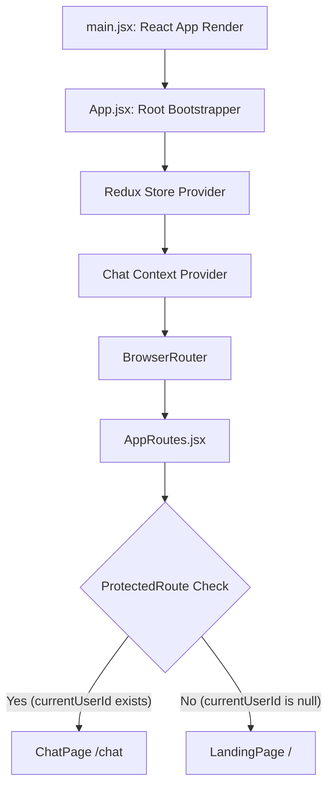
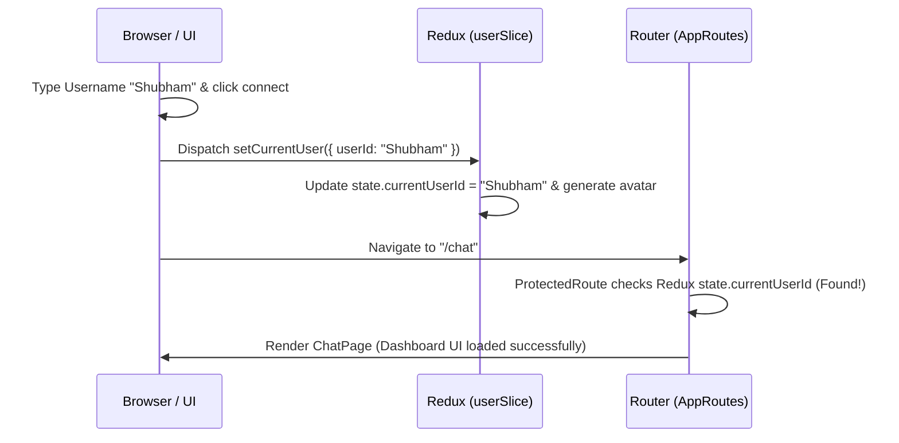
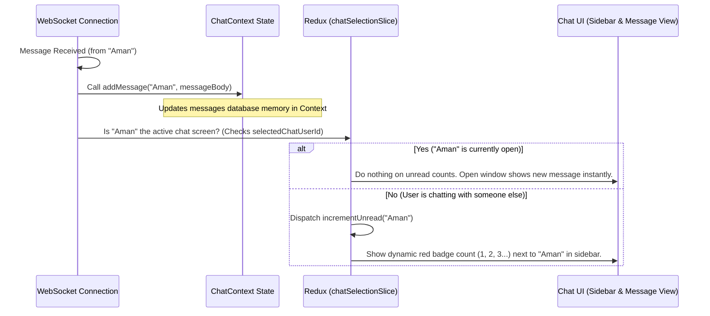

# React Chat Application: Routing, Redux, aur Context API ka Complete Guide

Hey! Is guide mein hum aapke project ke **Routing (React Router)**, **Redux Toolkit**, aur **Context API** ke complete integration aur structure ko detail mein samjhenge. Hum dekhenge ki kaunsi cheez kyun use ho rahi hai (the "Why"), unki files kaise configured hain, aur unka dynamic flow kaise chalta hai.

---

## Table of Contents
1. [High-Level Architecture (Overview)](#1-high-level-architecture-overview)
2. [Root Setup & Bootstrapping (`App.jsx` & `main.jsx`)](#2-root-setup--bootstrapping-appjsx--mainjsx)
3. [Client-Side Routing (`react-router`)](#3-client-side-routing-react-router)
4. [Redux Toolkit (Global Settings & UI State)](#4-redux-toolkit-global-settings--ui-state)
5. [Context API (Volatile High-Frequency Messages)](#5-context-api-volatile-high-frequency-messages)
6. [Data Flow: Jab User login karta hai aur Message receive hota hai](#6-data-flow-jab-user-login-karta-hai-aur-message-receive-hota-hai)

---

## 1. High-Level Architecture (Overview)

Aapke chat app mein state management aur navigation ko teen layers mein divide kiya gaya hai:



*   **Routing (`react-router`):** Handles client-side navigation. Ye control karta hai ki user kon se screen pe hai (Landing Page `/` ya Chat Page `/chat`) aur routes ko secure karta hai.
*   **Redux Toolkit (Global Store):** Ye application ki static, metadata, aur low-frequency states ko store karta hai, jaise: "Kaunsa user logged-in hai?", "Kon sa active chat partner select kiya gaya hai?", aur "UI theme kya hai?".
*   **Context API (`ChatProvider`):** Ye high-frequency, rapid and volatile (browser session-only) state ko manage karta hai, yaani aapke actual **chat messages**.

---

## 2. Root Setup & Bootstrapping (`App.jsx` & `main.jsx`)

Sabse pehle app startup browser mein render hone ke liye [main.jsx](file:///d:/2026June/React/chat-frontend/src/main.jsx) se call hota hai, jo humare root React component `<App />` ko render karta hai.

[App.jsx](file:///d:/2026June/React/chat-frontend/src/App.jsx) pure app ko global shell providers ke sath wrap karta hai. Iska structural priority aur wrapping order niche diye gaye code ke mutabik hai:

```jsx
// File: src/App.jsx
import { Provider } from 'react-redux';
import { BrowserRouter } from 'react-router';
import { store } from './app/store';
import { ChatProvider } from './context/ChatContext';
import AppRoutes from './routes/AppRoutes';
import { Toaster } from 'react-hot-toast';

function App() {
  return (
    <Provider store={store}> {/* 1. Redux Store wrapper sabse upar */}
      <ChatProvider>         {/* 2. Messages context store iske andar */}
        <BrowserRouter>      {/* 3. Navigation handler */}
          <AppRoutes />      {/* 4. Routing logic wrapper */}
          <Toaster position="bottom-right" /> {/* Notifications overlay */}
        </BrowserRouter>
      </ChatProvider>
    </Provider>
  );
}
```

### Wrapping Order kyun important hai?
1. **Redux Provider** sabse top par hai taaki iske andar aane waale Context, Routes, aur Components sabhi dispatch actions aur selectors use kar sakein.
2. **ChatProvider** uske andar hai kyunki real-time message aane par hume Redux state ki values read karni ho sakti hain (jaise ki *currently selected user* kaun hai, taaki check karein ki message direct display karein ya unread counter badhayein).
3. **BrowserRouter** routing tags (`<Routes>`, `<Route>`) ko parse karne ke liye required hai.

---

## 3. Client-Side Routing (`react-router`)

Humne application ko 3 main sections/paths mein organize kiya hai. Iski configurations [AppRoutes.jsx](file:///d:/2026June/React/chat-frontend/src/routes/AppRoutes.jsx) mein defined hain:

1.  **`/` (Landing Page):** Public portal. Jab tak user user-id enter karke session check-in nahi karega tab tak wo isi page par rahega.
2.  **`/chat` (Chat Page):** Main Dashboard area jahan sidebar, user directory, aur messaging container dikhta hai. Ye route **Protected** hai.
3.  **`/*` (NotFound Page):** Jab bhi user invalid path daalega toh ye 404 page trigger ho jayega.

### Router protection kaise kaam karti hai?
`ProtectedRoute` ek wrapper component hai jo check karta hai ki kya humare Redux store mein logged-in user ki `currentUserId` saved hai. Agar `currentUserId` nahi hai (null hai), toh user ko forcefully root `/` path par redirect kar diya jata hai:

```jsx
const ProtectedRoute = ({ children }) => {
  const currentUserId = useSelector(selectCurrentUserId); // Read user state from Redux

  if (!currentUserId) {
    // Redirect to landing page if user has not logged in
    return <Navigate to="/" replace />;
  }

  return children; // Allowed access
};
```

---

## 4. Redux Toolkit (Global Settings & UI State)

[store.js](file:///d:/2026June/React/chat-frontend/src/app/store.js) mein humne core global store create kiya hai jo teen major domains ko standard parameters ke sath separate slices mein control karta hai:

```javascript
// File: src/app/store.js
export const store = configureStore({
  reducer: {
    user: userReducer,                 // Manage login session & profiles
    ui: uiReducer,                     // Manage loading toggles & UI view states
    chatSelection: chatSelectionReducer, // Manage active selected user & unread counts
  },
});
```

### Slice 1: User Slice (`src/features/user/userSlice.js`)
*   **State:** `currentUserId`, `nickname`, `avatarUrl`, aur availability `status`.
*   **Purpose:** Jab user username daal kar connect button dabata hai, tab `setCurrentUser` reducer dispatch hota hai. Ye profile image generate karne ke liye dicebear API seed customize karta hai:
    ```javascript
    state.avatarUrl = `https://api.dicebear.com/7.x/adventurer/svg?seed=${encodeURIComponent(userId)}`;
    ```
*   **Sign-out:** `clearCurrentUser` state ko clean up aur status offline kar deta hai.

### Slice 2: UI Slice (`src/features/ui/uiSlice.js`)
*   **State:** `isGlobalLoading`, themes aur sidebars visual behaviors.
*   **Purpose:** API requests ya asynchronous tasks execute hote time overlay background loader triggers ko manipulate karna.

### Slice 3: Chat Selection Slice (`src/features/chat/chatSelectionSlice.js`)
*   **State:**
    *   `selectedChatUserId`: Vo dynamic client jisse user is time baat kar raha hai.
    *   `unreadCounts`: Map object jo show karta hai ki specific sender ne kitne messages bheje hain jab unka window focused nahi tha: `{ [senderId]: unreadCount }`.
    *   `onlineUsers`: Active websocket network connection standard dynamic listing users.
*   **Reducers:**
    *   `setSelectedChat(userId)`: Naye selected chat target user ko select karna. Automatic open dashboard hone par target user key unread counter set to `0`.
    *   `incrementUnread(userId)`: Jab naya message socket se recieve hota hai par wo current open window ka message nahi hota, tab state.unread increment (+1) ho jata hai.

---

## 5. Context API (Volatile High-Frequency Messages)

### Redux vs Context API: Messages store karne ke liye Context API kyun choose kiya?
Humare paas pure dynamic chat threads aur logs hain. Ise humne Redux mein na rakh kar React Context API mein rakha hai. Iske peeche 3 solid reasons hain:

1.  **High-Frequency Updates (Performance):**
    *   Real-time chat apps mein WebSocket streams ke through seconds mein multiple messages receive ho sakte hain.
    *   Redux mein jab bhi koi action dispatch hota hai, toh wo global store ke system pipeline se flow hokar pure tree-rendering update systems check karta hai. Ye frequent heavy updates UI rendering frames drop kar sakte hain.
    *   Context API se hum dynamic dynamic sub-tree level component scoping implement karke excessive updates optimize kar sakte hain.
2.  **Volatile Session Scope:**
    *   Requirements ke mutabik messages database state ko temporary browser dynamic memory mein rakhna hai, persistence (jaise localStorage/IndexedDB) ke bina.
    *   Context API is transient scope (sirf React Component Lifecycle ke active rehne tak) state storage ke liye perfectly match karta hai.
3.  **Separation of Concerns (Clean Architecture):**
    *   Redux humare metadata handles aur settings system ko clean and lightweight rakhta hai.
    *   Context API heavy raw array objects system (chat message history) handle karta hai.

### Files implementation:
Vite Fast Refresh warnings (`Fast refresh only works when a file only exports components...`) ko resolve karne ke liye context design architecture ko do split files mein banaya gaya hai:

#### 1. [ChatContextInstance.js](file:///d:/2026June/React/chat-frontend/src/context/ChatContextInstance.js) (Clean Instance)
Yahan context initialize aur default context declare hota hai:
```javascript
import { createContext } from 'react';
export const ChatContext = createContext(null);
export default ChatContext;
```

#### 2. [ChatContext.jsx](file:///d:/2026June/React/chat-frontend/src/context/ChatContext.jsx) (Provider Implementation)
Yahan memory cache updates array stores aur dynamic methods design hue hain. State configuration kuch aisi dikhti hai:
```javascript
// State structure (keyed by userId for direct accessing)
// conversations = {
//   "user_a": [ { id, senderId, receiverId, content, timestamp }, ... ],
//   "user_b": [ ... ]
// }
const [conversations, setConversations] = useState({});
```

*   **Helper Methods defined in Provider:**
    *   `createConversation(chatUserId)`: Ek khali conversation initialize karta hai agar exist na kare.
    *   `addMessage(chatUserId, message)`: Naye message object ko check karta hai duplicate verification (using ID) ke sath aur array state update karta hai.
    *   `removeConversation(chatUserId)`: Complete array session clean/clear delete kar deta hai.
    *   `clearConversation(chatUserId)`: Messages clean index clear kar deta hai path empty user instance maintain rakhte hue.
    *   `getConversation(chatUserId)`: Array key reference extract return function default backup value `[]` ke sath return karta hai.

---

## 6. Data Flow: Jab User login karta hai aur Message receive hota hai

### Case A: Jab User Login karta hai


### Case B: Jab WebSocket se Naya Message receive hota hai
Jab dynamic websocket module implementation start hoga tab backend subscriptions update action flow aisi dikhegi:

```javascript
// Example websocket subscription helper flow (Future socket handler integration point):
const onMessageReceived = (msg) => {
  // 1. Check message direction (Humne bheja ya message receive hua)
  const chatPartnerId = msg.senderId === currentUserId ? msg.receiverId : msg.senderId;

  // 2. Message ko Context API ke message thread store mein insert karo
  addMessage(chatPartnerId, msg);

  // 3. Unread alerts logic evaluation:
  // Agar ye user active chat partner nahi hai to Redux counter update karein
  if (chatPartnerId !== selectedChatUserId) {
    dispatch(incrementUnread(chatPartnerId)); 
  }
}
```



---

Aap is guide ko workspace console ya browser visualizer par as a cheatsheet use kar sakte hain developers support ke liye. Agar code related koi aur topic explore karna ho toh feel free to ask!
